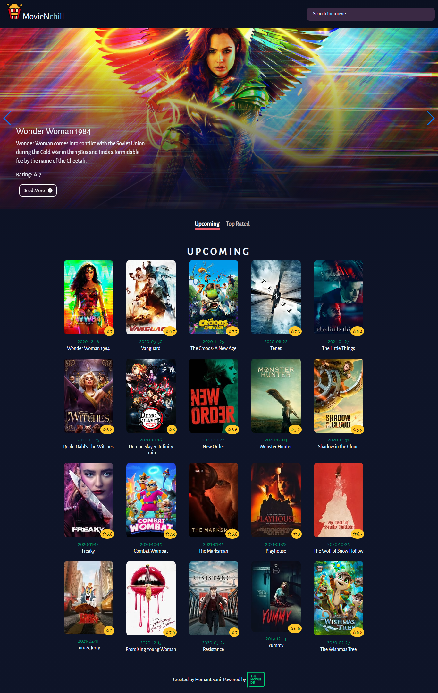
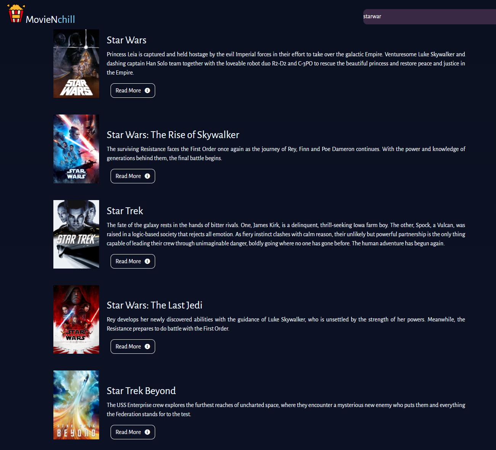
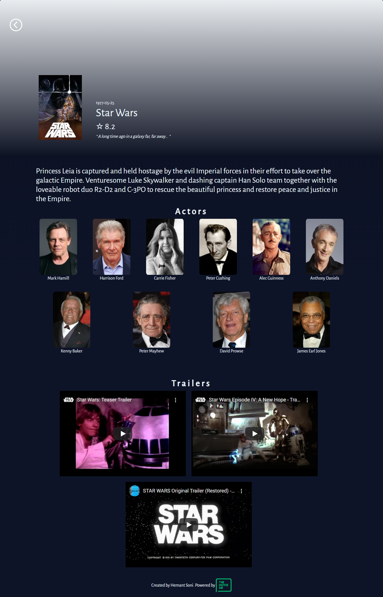

[![Contributors][contributors-shield]][contributors-url]
[![Forks][forks-shield]][forks-url]
[![Stargazers][stars-shield]][stars-url]
[![Issues][issues-shield]][issues-url]
[![License: MIT][license-shield]][license-url]
[![LinkedIn][linkedin-shield]][linkedin-url]


<!-- PROJECT LOGO -->
<br />
<p align="center">
  <a href="https://github.com/hemant-soni-vst-au4/movienchill">
    
  </a>

  <h3 align="center">MovieNchill</h3>

  <p align="center">
    MovieNchill browsing wep app created with React/Redux and TMDB API.
    <br />
    <a href="https://github.com/hemant-soni-vst-au4/movienchill"><strong>Explore the docs »</strong></a>
    <br />
    <br />
    <a href="https://movienchill.herokuapp.com/">View Demo</a>
    ·
    <a href="https://github.com/hemant-soni-vst-au4/movienchill/issues">Report Bug</a>
    ·
    <a href="https://github.com/hemant-soni-vst-au4/movienchill/issues">Request Feature</a>
  </p>
</p>

<!-- TABLE OF CONTENTS -->
## Table of Contents

* [About the Project](#about-the-project)
  * [Built With](#built-with)
* [Getting Started](#getting-started)
  * [Prerequisites](#prerequisites)
  * [Installation](#installation)
* [Roadmap](#roadmap)
* [Contributing](#contributing)
* [License](#license)
* [Contact](#contact)
* [Acknowledgements](#acknowledgements)

<!-- ABOUT THE PROJECT -->
## About The Project

This is a Single Page Application (SPA) built with React and Redux to browse and search movies. The design of the web app resembles Netflix. The data is fetched from [TMDB API](themoviedb.org).





#### Routes:

* `/` - home page.
* `/details/:id` - movie details page.


#### Features:

* Search movie
* View movie details
* movie trailer

### Built With

- React
- Redux
- ESLint
- Stylelint
- SASS
- Styled components
- npm
- TMDB API
- Prop-types
- [Netlify](https://movienchill.netlify.app/)

## Live demo

Deployed to Netlify - [live demo](https://movienchill.netlify.app/).

<!-- GETTING STARTED -->
## Getting Started

To get a local copy up and running follow these simple steps.

### Prerequisites

* npm

    ```sh
    npm install npm@latest -g
    ```

### Installation

1. Clone the repo

    ```sh
    git clone https://github.com/hemant-soni-vst-au4/movienchill.git
    ```

2. Change directory

    ```sh
    cd movienchill
    ```

3. Install NPM packages

    ```sh
    npm install
    ```

4. Start the local server

    ```sh
    npm start
    ```

<!-- ROADMAP -->
## Roadmap

Check the [issues](https://github.com/hemant-soni-vst-au4/movienchill/issues).

<!-- CONTRIBUTING -->
## Contributing

Contributions are what make the open-source community such an amazing place to learn, inspire, and create. Any contributions you make are **greatly appreciated**.

1. Fork the Project
2. Create your Feature Branch (`git checkout -b feature/AmazingFeature`)
3. Commit your Changes (`git commit -m 'Add some AmazingFeature'`)
4. Push to the Branch (`git push origin feature/AmazingFeature`)
5. Open a Pull Request

<!-- LICENSE -->
## License

Distributed under the MIT License. See `LICENSE` for more information.

<!-- CONTACT -->
## Contact

👤 **Hemant soni**

- Github: [@githubhandle](https://github.com/hemantso)
- Linkedin: [linkedin](https://www.linkedin.com/in/hemantso/)

<!-- ACKNOWLEDGEMENTS -->
## Acknowledgements

* Design inspirations
  * [Netflix-Redesign-challenge-on-Uplabs](https://dribbble.com/shots/5093535-Netflix-Redesign-challenge-on-Uplabs)
  * [Netflix-Redesign-Idea](https://dribbble.com/shots/5253521-Netflix-Redesign-Idea)
* README Icon from Icons8
* [Img Shields](https://shields.io)
* [Font Awesome](https://fontawesome.com)

<!-- MARKDOWN LINKS & IMAGES -->
<!-- https://www.markdownguide.org/basic-syntax/#reference-style-links -->
[contributors-shield]: https://img.shields.io/github/contributors/hemant-soni-vst-au4/movienchill.svg?style=flat-square
[contributors-url]: https://github.com/hemantso/movienchill/graphs/contributors
[forks-shield]: https://img.shields.io/github/forks/hemantso/movienchill.svg?style=flat-square
[forks-url]: https://github.com/hemantso/movienchill/network/members
[stars-shield]: https://img.shields.io/github/stars/hemantso/movienchill.svg?style=flat-square
[stars-url]: https://github.com/hemantso/movienchill/stargazers
[issues-shield]: https://img.shields.io/github/issues/hemantso4/movienchill.svg?style=flat-square
[issues-url]: https://github.com/hemantso/movienchill/issues
[license-shield]: https://img.shields.io/badge/License-MIT-yellow.svg
[license-url]: https://github.com/hemantso/movienchill/blob/development/LICENSE
[linkedin-shield]: https://img.shields.io/badge/-LinkedIn-black.svg?style=flat-square&logo=linkedin&colorB=555
[linkedin-url]: https://www.linkedin.com/in/hemantso/
